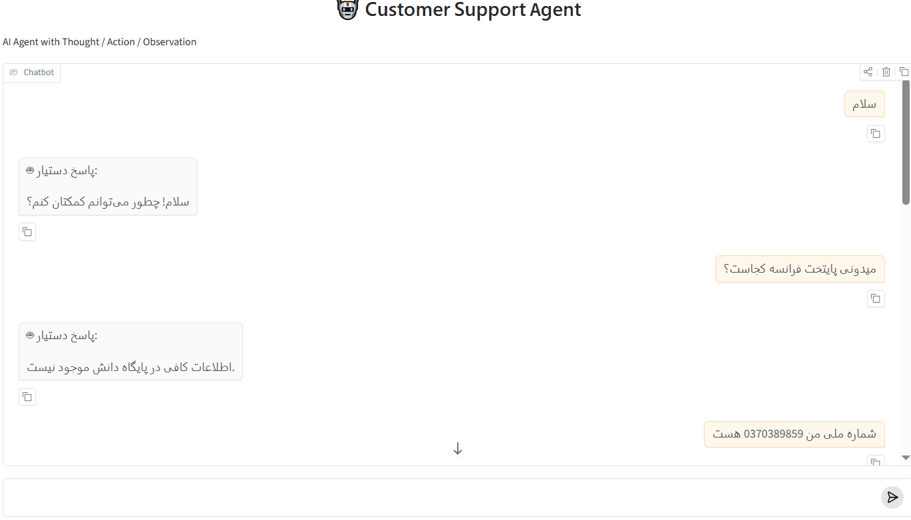

# Customer Support AI Agent

یک Agent هوشمند پشتیبانی مشتری مبتنی بر **LangGraph** که درخواست‌های کاربران را تحلیل کرده و بر اساس نوع درخواست، مسیر مناسب را انتخاب می‌کند.

این سیستم با ترکیب **LLM، RAG، API Tool و Guardrail** قادر است به سوالات دانش سازمانی، درخواست‌های عملیاتی و مکالمات عمومی پاسخ دهد.

---

## قابلیت‌ها

### Intent Routing با LangGraph

Agent ابتدا درخواست کاربر را تحلیل کرده و مسیر مناسب را انتخاب می‌کند:

* **RAG** برای سوالات مربوط به دانش سازمانی
* **API Tool** برای درخواست‌های عملیاتی مانند پیگیری سفارش
* **Chat** برای مکالمات عمومی

---

### Advanced RAG 

پیاده‌سازی یک Pipeline کامل Retrieval-Augmented Generation شامل:

* Document Loading
* Cleaning
* Parent-Child Chunking
* Embedding
* Dense Retrieval با Qdrant
* Sparse Retrieval با BM25
* Hybrid Retrieval با Reciprocal Rank Fusion
* Reranking
* Context Validation
* تولید پاسخ با LLM

---

### Tool Calling

Agent قابلیت اتصال به ابزارهای خارجی را دارد.

در این پروژه برای درخواست‌های مربوط به سفارش، Agent از API Tool استفاده کرده و اطلاعات لحظه‌ای مانند:

* وضعیت سفارش
* کد رهگیری
* اطلاعات ارسال

را دریافت می‌کند.

---

### Guardrail System

برای افزایش امنیت و کاهش خطاهای مدل، چندین لایه کنترل پیاده‌سازی شده است:

* Input Guardrail برای بررسی ورودی کاربر
* Context Guardrail برای بررسی صحت اطلاعات بازیابی‌شده
* Output Guardrail برای جلوگیری از پاسخ‌های بدون پشتوانه

---

### Logging

سیستم لاگینگ با ساختار ReAct پیاده‌سازی شده است:

* Thought
* Action
* Observation
* Success

که امکان بررسی کامل روند تصمیم‌گیری Agent را فراهم می‌کند.

---

# معماری سیستم


---

# تکنولوژی‌ها

## Agent Framework

* Python
* LangGraph
* LangChain
* OpenAI API

## Retrieval System

* Qdrant
* HuggingFace Embeddings
* BAAI/bge-m3
* BAAI/bge-reranker-v2-m3
* BM25
* FlagEmbedding

## Backend و Interface

* FastAPI
* Uvicorn
* Gradio

## Data و Configuration

* SQLite
* Pydantic Settings
* PDF Processing

## Logging

* Loguru

---

# ساختار پروژه

```
app/
│
├── agent/          # Workflow و Agent Logic
├── rag/            # Retrieval Pipeline
├── guardrails/     # Input و Output Validation
├── tools/          # External Tools
├── models/         # LLM Configuration
├── ui/             # Gradio Interface
└── core/           # Logger و تنظیمات
```

---

# نصب

```bash
pip install -r requirements.txt
```

---

# تنظیمات محیطی

ایجاد فایل `.env`:

```env
OPENAI_API_KEY=your_key

OPENAI_MODEL=gpt-4.1-mini

QDRANT_URL=http://localhost:6333

QDRANT_COLLECTION=customer_support

EMBEDDING_MODEL=BAAI/bge-m3
```

---

# اجرا

```bash
uvicorn app.mock_api.main:app --host 0.0.0.0 --port 8000 --reload

python app/ui/chat_app.py
```

---

# نمونه عملکرد
<p align="center">
  
</p>

---
